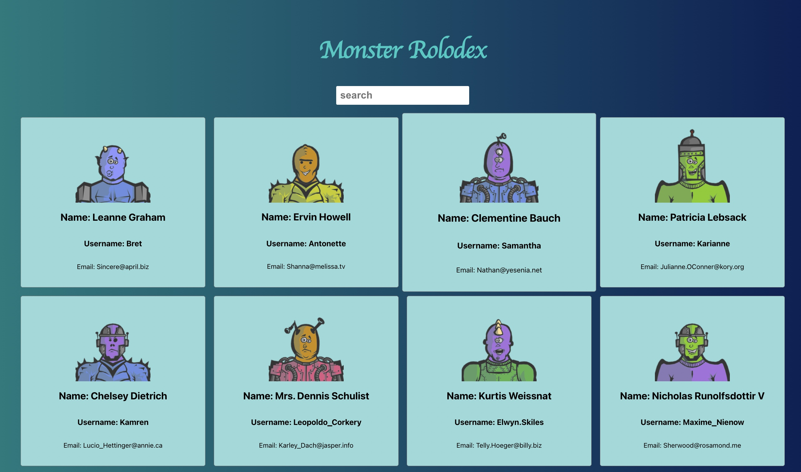

## Monster Molodox React App

## Project Overview

Monster Rolodex is a React app that displays a list of monsters fetched from an external API and their images generated using RoboHash API. The app uses React's useState hook to manage the app's state and useEffect hook to fetch data from the JSONPlaceholder API when the component mounts. The app also uses the RoboHash API to generate images for the monsters. The app is built with reusable components and has a simple search functionality that filters the monsters based on the user's input.

## Prerequisites

To get started with the project, you need to have Node.js and npm installed on your computer. If you don't have them installed, please follow the instructions on Node.js website to download and install them.

To get started with this project, follow these steps:

1. Clone the repository to your local machine.
2. Navigate to the project directory and install the dependencies by running npm install.
3. Start the development server by running npm run dev.

## API and Links

1. https://jsonplaceholder.typicode.com/users
2. https://robohash.org/${id}?set=set2&size=180x180

## React Hooks

React hooks used in the project.

1. useState
2. useEffect
